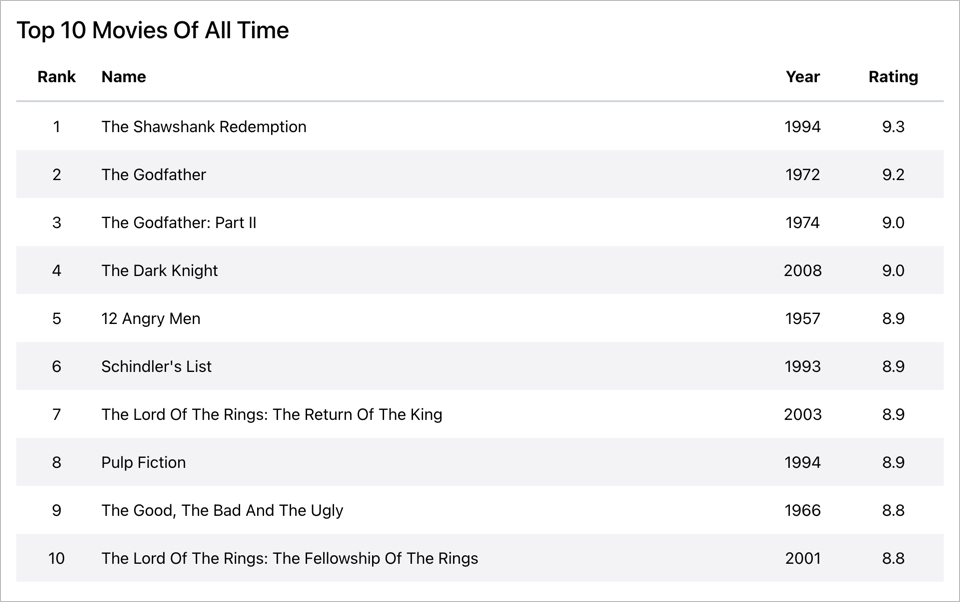

# React Shaper Demo

Example of starter application created by React Shaper.



## Running the App

Execute the following commands to run the app.

```shell
# In the root directory, install dependencies
npm install

# Run the app
npm run dev
```

Now point your browser to http://localhost:3000.

## Running Storybook

```shell
npm run storybook
```

## Running Unit Tests

```shell
npm run test # interactive mode
npm run test:coverage # non-interactive mode with coverage information
```

## Running End-to-End Tests

React Accelerate comes ready with Cypress to run end-to-end tests. Execute
Cypress using the following commands:

```sh
npm start # starts a local server hosting your react app

# run cypress in a different shell
npm run cypress
```
